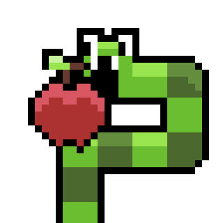
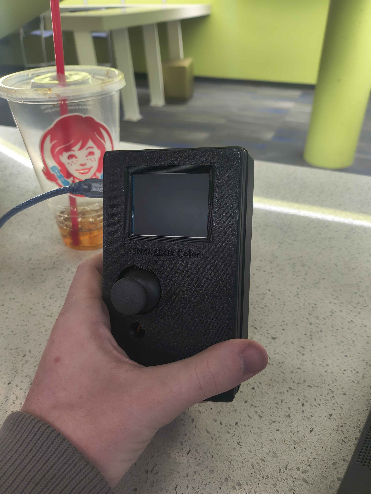

# Nico Castaldo 

## About Me

I'm a Computer Science student at CU Denver with minors in Mathematics and Data Science. 
I'm particularly interested in software engineering, game development, and working with data.

I enjoy building projects that give me an opportunity to learn new technologies and apply 
concepts from my coursework outside of individual assignments.

## Projects

### Academic Projects

#### Movie Hub
A full-stack movie and television review aggregation website.

- Built a REST API for movies, shows, users, and reviews
- MongoDB database
- React frontend
- User authentication with JWT

[View Project](https://github.com/itsh1ghn00n/CSC3916_Assignment5)

#### PantryPal
A team-developed web application for tracking household groceries and pantry information.

- Integrates with the Kroger API
- Tracks pantry inventory and expiration information
- Provides household spending and pantry insights

[Not Public Yet]

#### SnakeBoy 
A team-developed recreation of the game snake, using a 3d printed case and an Arduino UNO 

- Programmed the game's core Snake mechanics in C++
- Integrated physical controls and a display with the Arduino Uno
- Designed and assembled the project within a custom 3D-printed case

[View Project](https://github.com/itsh1ghn00n/Snake-Final)

### Personal Projects

#### State Machine Test Project
A small project exploring state machines and their applications in game development.

[Not Public Yet]

## Technologies

**Languages:** Python, C++, C#, JavaScript  
**Web:** React, REST APIs  
**Data:** MongoDB, NumPy, SciPy, Pandas  
**Tools:** Git, GitHub, Linux

## Contact

- GitHub: [Link](https://github.com/itsh1ghn00n)
- LinkedIn: [Link](https://www.linkedin.com/in/nico-castaldo/)
